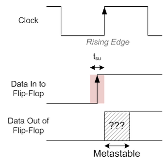
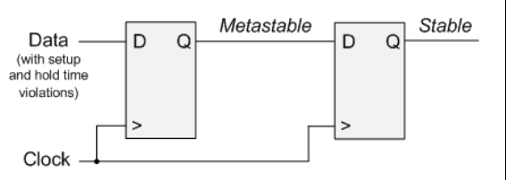

- # Reason
	- When [[Setup Time and Hold Time]] are violated
		- Sampling a signal external to the FPGA
		- Crossing clock domain
	- {:height 323, :width 323}
		- Output is metastable for some amount of time
			- After it settles to either a 0 or 1
- # Solution
	- Double-Flop
		- 
			-
			-