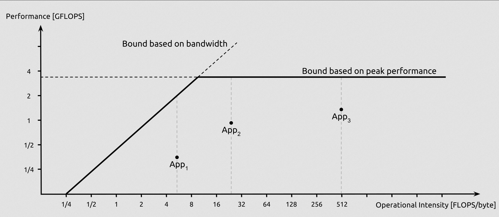

- ## Idea
	- Visualizes the maximum performance of a given computer architecture as a function of two factors
	  id:: 642f2670-3d87-4423-ad15-bdcdad09b0f7
		- Arithmetic Intensity
		- Performance Limit
- ## Definitions
	- Arithmetic Intensity
		- The number of arithmetic operations (such as floating-point operations) per byte of data transfer between memory and the processor
		- Example: Matrix Multiplication
		  collapsed:: true
			- A * B = C
				- size(A) = m * n
				- size(B) = n * p
					- Hence, size(C) = m * p
			- For double-precision, each floating-point element is 8-byte
			- Number of Arithmetic
				- For each element of C
					- n * multiplication
					- (n-1) * additions
					- Approximately 2*n arithmetic
				- In total C has m * p elements
					- Hence, total number of arithmetic is 2 * n * m * p
			- Total memory traffic
				- Size of A, B, and C
				- 8 * (m * n + n * p + m * p)
			- The Arithmetic Intensity
				- 2 * n * m * p / 8 * (m * n + n * p + m * p)
				- = n / 4 (n/p + n/m + 1)
				- Since n is usually much smaller than m and p
					- Approximately = 1 / 4 FLOP/byte
	- Performance Limit
		- Maximum computational capacity of a given computer architecture
			- By measure the peak performance of hardware
	- 
		- This line is rooftline
			- If an application falls below the roofline
				- It is not taking full advantage of the available hardware resources (Computational Capabilities)
-